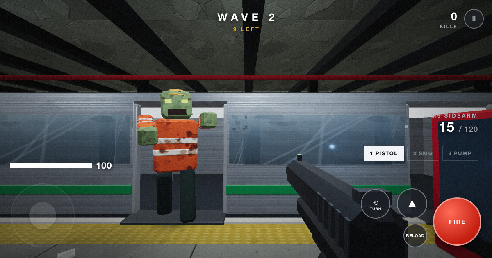

# Ashworth Station

**A single-file browser zombie-survival FPS.** Hold the uptown platform at Ashworth Street while the northbound pulls in and the doors open onto more of them. Fifteen waves. The last one is a train that keeps unloading. You will lose. Your highest score is the record.

**[Play in your browser](https://auaggy.github.io/ashworth-station/)**



---

> **My contribution was judgement, architecture, constraints and verification. The agents did the transcription.**

---

## Why I made it

What began as an AI experiment became an evenings-and-weekends project with my son, who is seven. We'd play, talk about what felt wrong, and decide what to change. The crawlers, the wave count, the graffiti, the pause limit and the TURN button were his ideas.

I am not a trained software developer. My background is in systems architecture and security. AI agents wrote the code. I supplied the constraints, the architecture those constraints forced, the judgement about what to keep, and the verification that decided whether any of it was finished.

My son and his friends tested it by playing. They reported bugs and asked for changes. I took their feedback to the agents, then tested the changes with the children. I decided what to ship.

**Scope.** This is a personal project, built on my own time and my own equipment. It is unrelated to my employer's business and uses no employer resources, data or IP.

## What this repository is, and what it demonstrates

This repository shows how I work when generation is cheap. I take a vague requirement from a non-technical stakeholder, impose constraints that force design decisions, and direct agents to build against them. Then I verify the result, break it, trace failures to their causes and fix them.

A game is a demanding test case for that. It has to hold 60 frames per second on a phone, it has to be correct with no server to correct it, and its audience has no patience and no interest in excuses.

The constraints below reflect my security background.

## Repository contents

| Path | What it is |
|---|---|
| `index.html` | The game. 4,050 lines, 184 KB, one document. |
| `vendor/` | Unmodified Three.js r170 (`three.module.min.js`, `RoomEnvironment.js`) + its MIT licence. |
| `sw.js` | Service worker. Precaches the page and the engine for offline boot. |
| `tests/` | Playwright browser suite, service-worker cases, fixed-budget render regression. |
| `tools/check.mjs` | Zero-install development checks (syntax, import-map locality, worker). |
| `docs/TESTING.md` | How to run the checks, and what they cannot prove. |
| `docs/VENDOR.md` | Third-party attribution. |
| `.github/` | Bug report form. |

There is deliberately **no `package.json`**. The game needs no install, build step or backend. Development tooling is installed outside the checkout to keep it out of the artifact.

## The constraints are the design

Four constraints, chosen at the start and held for the life of the project. Each closed off a category of problem before it could happen.

| Constraint | What it removes |
|---|---|
| **One HTML document for the game** | No build step, no bundler, no dependency tree. The artifact is a file you can hash and read. |
| **No authentication** | No credential surface, no session handling, no account enumeration, no password reset to get wrong. |
| **No telemetry** | No analytics, no identifiers, no PII, no consent banner, no retention question. |
| **No network dependency at runtime** | The engine is vendored and precached. After an online visit, the game can boot offline with an empty HTTP cache, provided Cache Storage is intact. |

The page is designed for constrained hardware. These choices remove account handling, telemetry and runtime CDN requests from the game. Progress and preferences stay in the browser.

Three.js is the sole third-party dependency and is **vendored locally**. `tools/check.mjs` parses the import map and fails the check if any bare import resolves outside `./vendor/` or its target file is missing.

### Offline by design, and narrow on purpose

`sw.js` precaches exactly four URLs: `./`, `./index.html`, `./vendor/three.module.min.js` and `./vendor/RoomEnvironment.js`. It ignores cross-origin requests and answers navigations from the cached page first. Its cache does not grow at runtime: it serves only exact pre-cached assets and never looks in another app's cache.

Bumping `CACHE` replaces the cached page and engine together. On activation, the worker deletes every older `ashworth-*` cache. This was hardened after a review found the worker's cache ownership was not isolated (see *What testing caught*).

## How it was built

The first version came from one prompt. It produced a working zombie FPS in about fifteen minutes, and it was fun the way a sketch is fun. The loop worked, the mood was right, and the code was a house of cards. Any real change risked collapsing it, and it would never have survived a phone.

It was then rebuilt and hardened over five weeks for a child on a phone and a desktop player with a mouse.

1. **Requirements.** Elicited conversationally from a seven-year-old. A desire such as "you should be able to shoot them in the head" had to become a specification. Translating those requests into systems is the design work.
2. **Constraints.** Four, fixed early, never relaxed when they became inconvenient. Most of the architecture falls out of them.
3. **Implementation.** Agent-assisted throughout, on feature branches, against a written review and implementation plan.
4. **Verification.** I ran automated checks, played on real devices and traced failures to their causes.

The 44 commits use conventional prefixes (`fix:`, `test:`, `render:`, `docs:`, `chore:`, `feat:`) and record the reasoning for changes. Examples:

- `fix: make movement converge to configured speed at every refresh rate`
- `fix: isolate Ashworth service worker cache ownership`
- `fix: normalize saved progress and validate best runs`
- `fix: keep read-only announcements out of canvas hit testing`
- `test: run the same regression cases in desktop WebKit`
- `docs: record automated acceptance and device-validation limits`
- `chore: retire implementation tooling`

Tests and documentation ship with the fixes, including a record of what the automated checks cannot prove.

## Verification

### Automated

```sh
node tools/check.mjs          # no install required
node tests/browser.mjs        # Playwright; browsers installed outside the checkout
node tests/render.mjs         # graphics regression, Chromium only
```

`tools/check.mjs` runs with nothing installed. It syntax-checks every executable script in the page, the worker and the vendored modules; it asserts that every bare import in the import map resolves to a local file that exists; and it runs the service-worker cases.

`tests/browser.mjs` drives real browser behaviour through Playwright and can run the same cases in desktop WebKit (`ASHWORTH_BROWSER=webkit`), or re-run a subset (`--only='movement|spawns'`). `tests/render.mjs` captures matched scenes at a fixed rendering budget so graphics changes can be compared in screenshots.

### Honest limits

The project documents the limits of its automated checks:

> Headless timings do not establish real-device performance.
>
> Desktop touch emulation cannot verify Safari device behavior, heat or battery use.

The release checklist also requires playing EASY and HERO with mouse and touch, checking app switching, orientation, audio, restart and offline reload after an online visit. Test on actual phones and tablets, including a sustained session on iPad and iPhone Safari.

### What testing caught

Each of these was a symptom first. The fix is often one line; the work was finding the cause.

| Symptom | Root cause |
|---|---|
| Game went silent on iOS after a few plays | A new `AudioContext` per gesture hit Safari's ~4-context ceiling. Create once, resume forever, never rebuild. |
| Silent on iOS with the volume up | WebAudio defaulted to the `ambient` session, which the ring/silent switch mutes. Request `playback` instead. |
| WASD dead on AZERTY and Dvorak | Input mapped `e.key` (the layout's letter) instead of `e.code` (physical position). |
| Touch laptop got the mobile build | Capability sniffing cannot distinguish a touchscreen from a touch *primary input*. The game asks `(pointer: coarse)`. |
| Balance collapsed after a bug fix | Attacks began landing reliably instead of being stepped out of, so the old per-hit damage multiplied by the new hit rate was a two-second death. The fix also reduced damage to account for the higher hit rate. |
| Tall enemies became unhittable | The broad-phase sphere was centred on the feet at a fixed radius. Fixed by centring on mid-body and scaling with enemy size. |
| Crawler would have become unhittable too | Hit volumes, broad-phase centres and aim-assist heights became per-type properties. A prone enemy has no body where an upright one's is. |
| Corrupted or hand-edited save broke the game | Saved progress is parsed as untrusted input. Loading checks safe non-negative integers and finite values, reads only five badge entries, and accepts a badge only when its value is `=== true`. |
| Service worker served another app's cached asset | The worker's cache ownership was not isolated. It now refuses cross-origin and serves only exact pre-cached URLs. |
| Every texture on chamfered boxes rotated | A UV bug in the box geometry, fixed at the geometry rather than per-texture. |
| Screen-reader announcements intercepted clicks | Read-only announcements sat inside canvas hit testing. |

Comments beside the relevant code record the reasoning behind each fix.

## Architecture notes

The file is one sequence of systems, each behind a banner comment: helpers, audio engine, renderer, canvas textures, materials, geometry, train, express, effects, enemies, weapons, player, prestige, shooting, movement, wave director, input, touch input, screens, loop.

**The render budget is the design.** To reduce per-fragment work on phones, the renderer uses a smaller budget when the primary pointer is coarse. It caps pixel ratio at 1.25, drops multisampling, caps anisotropic filtering at 4× instead of 16×, and shrinks the dynamic light pool from 6 to 4. With the headlamp, the express train and muzzle flash already present, six pool lights mean nine punctual lights looping per fragment; four pool lights mean seven, about 22% fewer.

Pixel ratio also adapts at runtime. FPS is measured over two-second windows: below 44 it drops the ratio in 0.25 steps to a floor of 0.7; above 58 it climbs back in 0.25 steps to the initial cap.

**Static geometry updates once.** World matrices update once, then `matrixAutoUpdate` is disabled for everything that does not move. The train, its doors, enemies and effects keep per-frame updates. Geometry and materials are shared: seven benches used to mean 84 geometry objects and seven identical shadow materials; they now use one buffer and one material per shape.

**Audio must never kill a frame.** Sound is fully synthesised, including a generated impulse response for convolution reverb. Impact sounds sit inside the pellet loop and wave cues sit mid-update. Sound-effect calls are wrapped so an exception cannot abort damage application or the rest of the frame.

**Enemy hits use ray-sphere tests.** Each enemy has four local-space hit spheres, with separate layouts for upright enemies and crawlers. Each pellet is tested only up to the nearest world hit. Headshots use the weapon's multiplier; body hits use 1.0× / 0.9× / 0.7× for upright enemies and 1.0× / 0.85× / 0.6× for crawlers.

Touch aim assist lerps a shot 55% toward an enemy's aim point when it falls within about seven degrees. It makes a child on a phone lethal without making misses impossible. Mouse mode gets no aim assist.

**Progress and preferences stay in the browser.** The profile is `localStorage['ashworthSave']`, containing `{ ngP, badges, best }`. `ashworthDiff` holds the one-character difficulty preference; `ashworthPrefs` holds mute and reduced-effects preferences. Clearing site data clears them. Storage reads and writes are wrapped to handle failures such as Safari private-mode write errors.

## Tuning reference

Weapon stats are defined in `WDEF`; enemy base stats are set in `spawnZombie`.

**Weapons**

| | M9 Sidearm | MK9 SMG | 870 Pump |
|---|---|---|---|
| Fire | Semi-auto | Full-auto | Pump-action |
| Damage | 38 | 21 | 19 × 9 pellets |
| Rate | 330 rpm | 820 rpm | 78 rpm |
| Magazine | 15 | 32 | 6 |
| Reserve (max) | 120 (180) | 280 (400) | 48 (80) |
| Reload | 1.35 s | 1.85 s | 2.6 s |
| ADS spread | 0.0016 | 0.008 | 0.046 |
| Headshot multiplier | 2.9× | 2.2× | 1.7× per pellet |
| ADS field of view | 62 | 57 | 60 |

The M9 is the skill weapon: one headshot kills a base walker (38 × 2.9 = 110.2 against 100 HP). The MK9 is the panic button. The 870 is the conversation ender, and its 2.6-second reload is an eternity when something is running at you.

**Enemies**

| | Walker | Runner | Crawler | Brute | Conductor |
|---|---|---|---|---|---|
| HP | 100 | 66 | 58 | 420 | 750 |
| Speed | 1.55 | 3.35 | 2.55 | 1.15 | 1.0 |
| Damage | 7 | 6 | 9 | 18 | 24 |
| Reach | 1.95 | 1.85 | 1.60 | 2.35 | 2.7 |
| Scale | 0.92 | 0.82 | 0.95 | 1.32 | 1.85 |
| Points | 100 | 150 | 180 | 400 | 1500 |
| Eye colour | yellow-green | green | cyan | orange | red |
| Swing gap / windup | 1.05 / 0.24 | 0.85 / 0.18 | 0.95 / 0.18 | 1.35 / 0.34 | 1.20 / 0.34 |
| First appears | wave 1 | wave 3 | wave 3 | wave 5 | wave 15 |

`gap` is seconds between swings; `windup` is the telegraph before a hit registers. The crawler's cyan eye is distinct from the other enemies' eyes. At a downward glance in the dark, eye colour is what reads at range.

**Scaling**, applied at spawn (`base` is the corresponding enemy stat):

```js
hp  = base * (1 + (wave-1) * 0.11) * 1.30 ** ngP * (easy ? 0.8 : 1)
spd = base * (1 + Math.min(0.55, (wave-1) * 0.045)) * (1 + Math.min(0.6, 0.12 * ngP))
dmg = (base + (wave-1) * 0.55) * (1 + 0.25 * ngP) * (easy ? 0.6 : 1)
```

Each zombie also rolls a 0.9×–1.12× speed jitter, so the same wave never moves the same way twice.

**Waves.** HERO wave size is `min(44, 5 + round(wave × 3.1))`, with 36 enemies on the final wave. EASY uses 80% of that count, rounded to the nearest integer with a minimum of four; its final wave has 29 enemies. Runners and crawlers both join at wave 3, brutes at wave 5, conductors only on the last train. Composition is built as a counted list and then shuffled to keep each wave's mix consistent.

Ordinary waves use a base spawn interval of `max(0.16, 0.80 − wave × 0.055)` seconds; the final wave uses 0.24 seconds. Each spawn delay is multiplied by a random factor between 0.7 and 1.35.

**Progression.** Clearing wave 15 advances prestige for your next New Game+ run and awards the next unearned badge, up to five.

| Badge | Earned | Effect |
|---|---|---|
| BRAVE | 1st win | +12% weapon damage |
| DEADEYE | 2nd win | +0.5 headshot multiplier |
| SPEEDLOADER | 3rd win | −20% reload time |
| SCAVENGER | 4th win | More ammo drops and restock |
| SPRINTER | 5th win | +10% move speed |

Prestige and badges survive a loss on NG+. A loss can also set the best-score record: a game you are meant to lose has to count the losses.

**Difficulty.** Two chips on the title screen. **HERO** is the real game. **EASY** cuts enemy health to 80%, their damage to 60%, wave sizes to 80%, raises ammo drops and regenerates faster. Touch mode defaults to EASY, because a thumb on a glass screen is a worse gun than a mouse. The choice persists.

## Run your own copy

```sh
git clone https://github.com/AUAggy/ashworth-station.git
cd ashworth-station
python3 -m http.server 8000
```

Open <http://localhost:8000/> in a WebGL-capable browser. No build step and no backend.

Keep `index.html`, `vendor/` and `sw.js` together and serve them over HTTP. The page is an ES module that imports the engine by bare specifier, and browsers treat `file://` as a null origin.

## Development checks

See [`docs/TESTING.md`](docs/TESTING.md). The game itself needs no installation; the tools are for development only and are deliberately installed outside the checkout.

After changing `index.html` or anything in `vendor/`, bump `CACHE` in `sw.js`. This replaces the cached page and engine together on the next service-worker update.

## Known limitations

- Real-device performance is verified by playing on phones and tablets. Headless timings cannot establish it.
- Safari device behaviour (heat, battery and audio under a sustained session) is verified on hardware. Touch emulation on a desktop cannot stand in for it.
- Offline boot depends on Cache Storage, which browsers and users can clear. The game works online regardless.

## Support

For optional support, the sponsor button at the top of the repository goes to Buy Me a Coffee.

## Licence

MIT. See [LICENSE](LICENSE). Third-party attribution: Three.js r170, MIT. See [`docs/VENDOR.md`](docs/VENDOR.md) and [`vendor/LICENSE`](vendor/LICENSE). Keep that licence with redistributed copies.

---

*Built because a kid needed a game worth losing.*