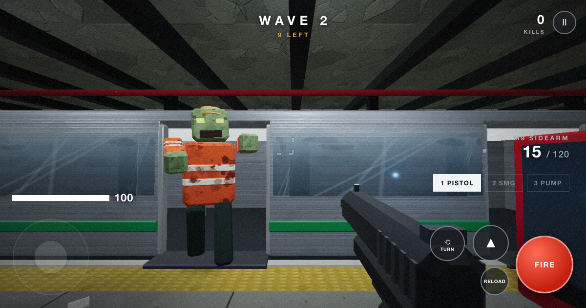

# Ashworth Station

A browser-based zombie survival FPS I made for my seven-year-old, with his ideas and guidance.

[Play in your browser](https://auaggy.github.io/ashworth-station/)



## Why I made it

What began as an AI experiment became an evenings-and-weekends project with my son. We'd play, talk about what felt wrong, and decide what to change. The crawlers, wave count, graffiti, pause and TURN button were his ideas.

I come from systems architecture, not software development. AI agents wrote all the code. I set the gameplay and the constraints: one HTML file for the game, phones and tablets first, and controls my son could use. I also expected it to keep working when a player switched apps or restarted a run.

My son and his friends tested it by playing. They reported bugs and asked for changes. I took their feedback to the agents, then tested the changes with the children. I decided what to keep and what to leave out.

## Run your own copy

```sh
git clone https://github.com/AUAggy/ashworth-station.git
cd ashworth-station
python3 -m http.server 8000
```

Open <http://localhost:8000/> in a WebGL-capable browser. No build step or backend.

The game lives in `index.html`; the local Three.js engine in `vendor/` and the offline worker `sw.js` ship beside it. Keep those files together and serve them over HTTP rather than double-clicking the HTML.

[Report a bug](https://github.com/AUAggy/ashworth-station/issues) · [Development checks](docs/TESTING.md)

MIT licensed. See [LICENSE](LICENSE) and [third-party attribution](docs/VENDOR.md).
